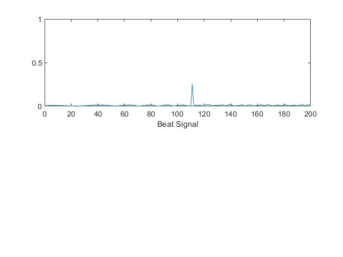
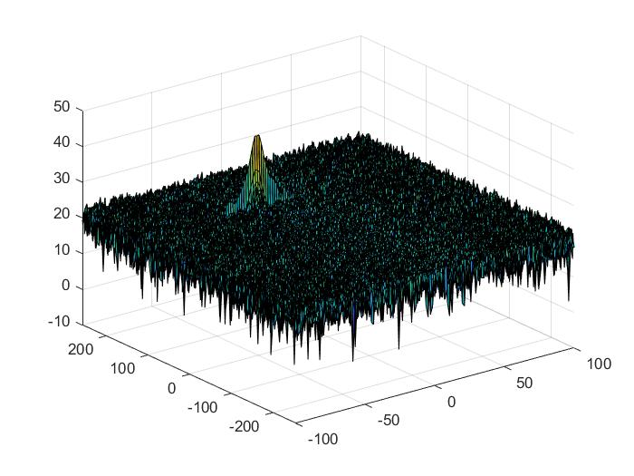
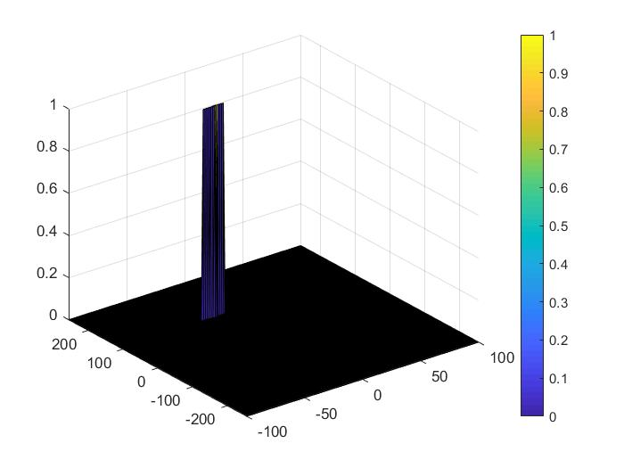

# SFND-Radar-Target-Generation-and-Detection

This repository contains Matlb imlementation of CFAR algorithm.

## Implemetation

### Defing initial position and velocity of target

		PRange = 110;
		Velocity = 50;

### FMCW (Frequency modulated continuous wave) waveform generation

These are the equations which is used for finding Bandwidth, time chirp, and slop

		RResolution = 1;
		c = 3e8; %universal constant
		RMax = 200;

		Bsweep = c/2*RResolution;
		Tchirp = 5.5*2*RMax/c; % sweep time 5.5
		slope = Bsweep/Tchirp;

Setting number of chirps (Nd) as 128 and number of samples in each chirp (Nr) as 1024, total time is generated using linspace function.

t=linspace(0,Nd*Tchirp,Nr*Nd); %total time for samples

Next step is to create vectors for all signals, transmited signal, received signal, and beat signal.

		%Creating the vectors for Tx, Rx and Mix based on the total samples input.
		Tx=zeros(1,length(t)); %transmitted signal
		Rx=zeros(1,length(t)); %received signal
		Mix = zeros(1,length(t)); %beat signal

		%Similar vectors for range_covered and time delay.
		r_t=zeros(1,length(t));
		td=zeros(1,length(t));

Finally generating signals using a loop

		for i=1:length(t)         
		    
		    
		    % *%TODO* :
		    %For each time stamp update the Range of the Target for constant velocity. 
		    r_t(i) = PRange + Velocity * t(i);
		    
		    % *%TODO* :
		    %For each time sample we need update the transmitted and
		    %received signal. 
		    td(i) = 2*r_t(i)/c; %time delay
		    Tx(i) = cos(2*pi*(fc*t(i)+slope*(t(i)^2)/2));
		    Rx(i)  = cos(2*pi*(fc*(t(i)-td(i)) + (slope*(t(i)-td(i))^2)/2));
		    
		    % *%TODO* :
		    %Now by mixing the Transmit and Receive generate the beat signal
		    %This is done by element wise matrix multiplication of Transmit and
		    %Receiver Signal
		    Mix(i) = Tx(i).*Rx(i);
		    
		end

### Range measurement

		 % *%TODO* :
		%reshape the vector into Nr*Nd array. Nr and Nd here would also define the size of
		%Range and Doppler FFT respectively.
		MixResized = reshape(Mix,[Nr, Nd]);
		 % *%TODO* :
		%run the FFT on the beat signal along the range bins dimension (Nr) and
		%normalize.
		MixFft = fft(MixResized,Nr)/Nr;
		 % *%TODO* :
		% Take the absolute value of FFT output
		MixFft = abs(MixFft);
		 % *%TODO* :
		% Output of FFT is double sided signal, but we are interested in only one side of the spectrum.
		% Hence we throw out half of the samples.
		MixFft = MixFft(1:(Nr/2));
		
		%plotting the range
		figure ('Name','Range from First FFT')
		subplot(2,1,1)
		
		 % *%TODO* :
		 % plot FFT output 
		plot(MixFft);           
		xlabel('Beat Signal');
		 
		axis ([0 200 0 1]);

### Range Doppler response

		% Range Doppler Map Generation.
		
		% The output of the 2D FFT is an image that has reponse in the range and
		% doppler FFT bins. So, it is important to convert the axis from bin sizes
		% to range and doppler based on their Max values.
		
		Mix=reshape(Mix,[Nr,Nd]);
		
		% 2D FFT using the FFT size for both dimensions.
		sig_fft2 = fft2(Mix,Nr,Nd);
		
		% Taking just one side of signal from Range dimension.
		sig_fft2 = sig_fft2(1:Nr/2,1:Nd);
		sig_fft2 = fftshift (sig_fft2);
		RDM = abs(sig_fft2);
		RDM = 10*log10(RDM) ;
		
		%use the surf function to plot the output of 2DFFT and to show axis in both
		%dimensions
		doppler_axis = linspace(-100,100,Nd);
		range_axis = linspace(-200,200,Nr/2)*((Nr/2)/400);
		figure,surf(doppler_axis,range_axis,RDM);

### CFAR implementation

Training cells are set as 12 and 3 in both direction and guard cells are set 4 and 1. offset is set as 15 

		%Select the number of Training Cells in both the dimensions.
		Tr = 10;
		Td = 6;
		
		%Select the number of Guard Cells in both dimensions around the Cell under 
		%test (CUT) for accurate estimation
		Gr = 4;
		Gd = 2;

		% offset the threshold by SNR value in dB
		offset = 20;

Iterating over range and doppler, CFAR is implemented.

		CFAR = zeros(size(RDM));
		
		   % Use RDM[x,y] as the matrix from the output of 2D FFT for implementing
		   % CFAR
		    for iterateRange = Tr + Gr + 1 : Nr/2 - Tr - Gr
		        for iterateDoppler = Td + Gd + 1 : Nd - Td - Gd
		
		            trainingCFAR = db2pow(RDM(iterateRange - Tr - Gr : iterateRange + Tr + Gr, iterateDoppler - Td - Gd : iterateDoppler + Td + Gd));
		
		            trainingCFAR(iterateRange - Gr : iterateRange + Gr,iterateDoppler - Gd : iterateDoppler + Gd) = 0;
		
		            trainingCFAR = pow2db(sum(trainingCFAR) / ((2 * Tr + 2 * Gr + 1) * (2 * Td + 2 * Gd + 1) -((2 * Gr + 1) * (2 * Gd + 1))));
		
		            threshold = trainingCFAR + offset;
		        end
		    end

## Results

## Run the code

Open the file in matlab and the it will run. This file has no any additional dependencies.

